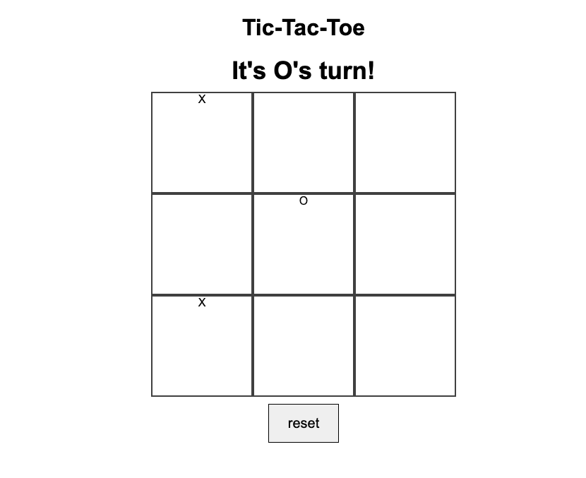

# Tic-Tac-Toe Game

## Description:

This a browser game of tic-tac-toe

[This is a hyperlink](https://www.bbc.co.uk)

## how to install:

- Clone the repository
- Open the index.js file in a web browser
- Play the game with a partner 'X' goes first
 

## Improvements:

- Make it so the game doesn't continue after a winner is announced
- Make it so players can keep score
- Make it so players have the option of who can go first (right now, X always goes first)
- Make it so after a square is filled in with one mark it cannot be changed
